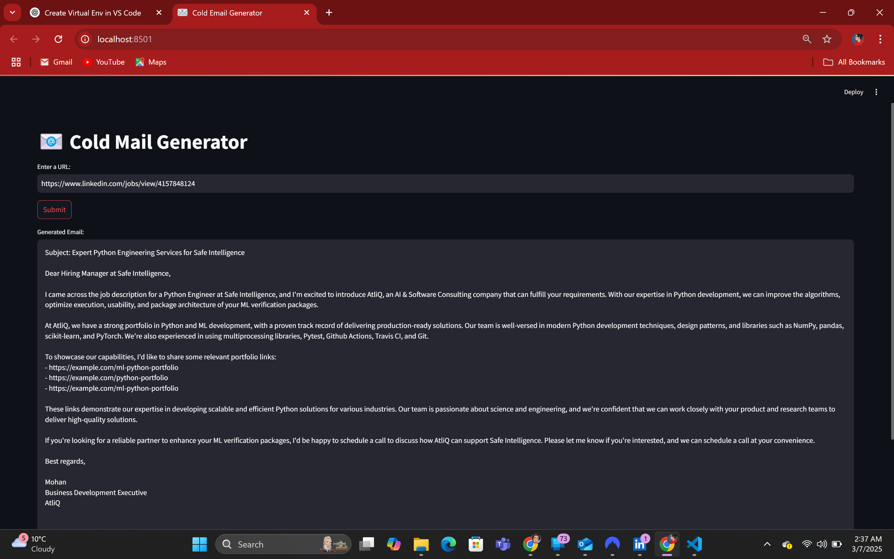

# 📧 Cold Mail Generator  

  

## **🔹 Overview**  
Cold Mail Generator is a **Streamlit web application** that helps users generate **cold emails** by extracting job details from a given **job posting URL**. The app uses **AI-powered job description parsing** and automatically **adds relevant portfolio links** from a CSV file (`my_portfolio.csv`) to create personalized cold emails.  

---  

## 🚀 **Features**  

✅ **Job Posting Scraper** - Extracts job details from a given URL using `WebBaseLoader`.  
✅ **AI-Powered Email Generator** - Uses `LangChain` & `ChatGroq` to craft cold emails.  
✅ **Portfolio Integration** - Dynamically fetches relevant portfolio links based on job requirements.  
✅ **Streamlit UI** - Simple and interactive web interface.  
✅ **Virtual Environment Support** - Easily set up using `venv`.  
✅ **Powered by Groq Playground** - Supports **cutting-edge LLMs like DeepSeek** for enhanced email generation.  
✅ **Uses Llama-3.3-70b-Versatile Model** - The project utilizes `Llama-3.3-70b-Versatile` for advanced AI-generated email writing.  

---  

## 🔧 **Tech Stack**  

| Technology         | Usage |  
|--------------------|--------|  
| **Python**        | Core programming language |  
| **Streamlit**     | UI framework for web application |  
| **LangChain**     | AI-powered text processing |  
| **ChatGroq**      | Language model for email generation |  
| **Llama-3.3-70b-Versatile** | AI model used for generating personalized cold emails |  
| **DeepSeek LLM**  | Future support for latest AI models via Groq Playground |  
| **BeautifulSoup4** | Web scraping (if needed for advanced functionality) |  
| **ChromaDB**      | Vector database for storing portfolio links |  
| **Python-dotenv** | Environment variable management |  

---  

## ⚙️ **Setup Instructions**  

### **1️⃣ Create a Virtual Environment**  
Run the following command in the **project directory**:  
```sh  
python -m venv venv  
```  

### **2️⃣ Activate the Virtual Environment**  
**For Windows (PowerShell):**  
```sh  
venv\Scripts\Activate.ps1  
```  
**For macOS/Linux:**  
```sh  
source venv/bin/activate  
```  

### **3️⃣ Install Dependencies**  
Install all required libraries from `requirements.txt`:  
```sh  
pip install -r requirements.txt  
```  

### **4️⃣ Generate Your API Key from Groq Playground**  
To use the AI-powered email generation, you need an **API key** from **Groq Playground**:  
1. **Go to** [Groq Playground](https://groq.com/playground).  
2. **Sign up or log in** with your account.  
3. **Navigate to API Keys** in your account settings.  
4. **Generate a new API key** and copy it.  

### **5️⃣ Add Your API Key**  
Create a `.env` file in the root directory and add your **Groq API key**:  
```sh  
GROQ_API_KEY = "your_api_key_here"  
```  
This key is loaded using the `python-dotenv` library.  

### **6️⃣ Run the Application**  
Start the **Streamlit** app:  
```sh  
streamlit run main.py  
```  
The app will open in your browser at `http://localhost:8501`. 🎉  

---  

## 📌 **How It Works**  

1️⃣ **Enter a job posting URL** (e.g., LinkedIn, Nike Jobs).  
2️⃣ Click **Submit** to extract job details.  
3️⃣ The AI **analyzes the job post** and **fetches relevant portfolio links**.  
4️⃣ The app generates a **custom cold email** using AI.  
5️⃣ Copy & use the email for outreach! 🚀  

---  

## 📁 **Project Structure**  

```
📂 Cold Mail Generator  
│── 📄 .env                    # Stores API keys (DO NOT COMMIT TO GIT)  
│── 📄 .gitignore              # Specifies files to ignore in Git  
│── 📄 requirements.txt        # Dependencies list  
│── 📄 main.py                 # Streamlit app UI & logic  
│── 📄 chains.py               # AI job extraction & email generation logic  
│── 📄 portfolio.py            # Portfolio link management  
│── 📄 utils.py                # Text cleaning functions  
│── 📄 my_portfolio.csv        # Portfolio data (skills & links)  
│── 📂 screenshots             # Folder containing UI and output screenshots  
│── 📄 screenshots/AppHomePage.png         # Screenshot of the app UI  
│── 📄 screenshots/llm_response.png        # Example AI-generated email  
```  

---  

## 🔥 **Example Output**  

  

---  

## 🎯 **Future Improvements**  
🚀 Support for **multiple job board sources**  
🚀 More **customization options** for emails  
🚀 Advanced **email personalization features**  
🚀 **Enhanced AI models via Groq Playground** – Future integration with **DeepSeek LLM** for more advanced, high-speed email generation  

---  

## 🛑 **Important Notes**  
⚠️ **DO NOT SHARE `.env` FILE PUBLICLY** – Add it to `.gitignore` to prevent exposing API keys.  
⚠️ Ensure your **virtual environment is activated** before running the app.  

---  

### **📢 Contributions & Feedback**  
Feel free to **fork the repository**, create **pull requests**, or open **issues** for feature requests! 🚀  

---  

